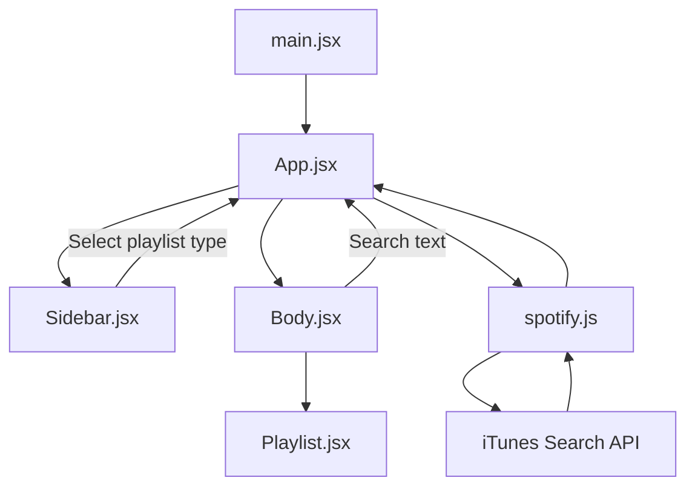
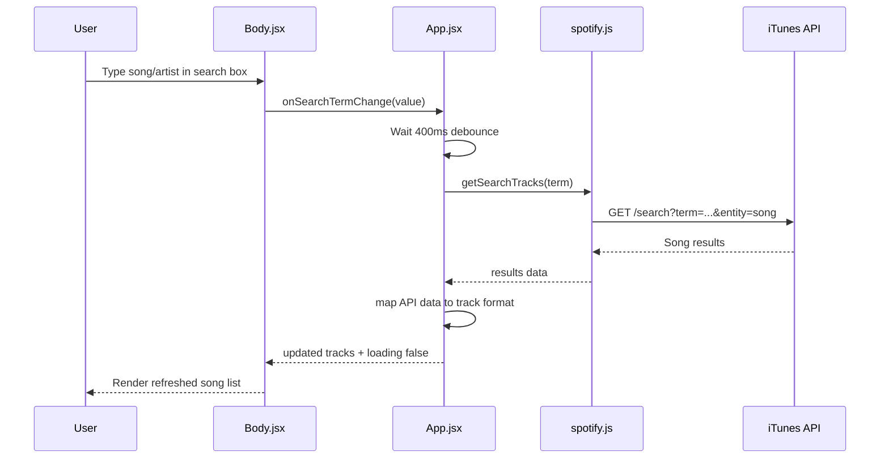

# Spotify Clone (Demo Mode)

A simple Spotify-style clone built with React functional components and Axios, using public demo tracks from an API.

## Features

- Opens directly to the home page (no login)
- Playlist-type home page with multiple categories
- Tracks loaded from a public API
- Search songs by keyword
- Track info: name, artists, album image
- Song list with album + duration + external track link
- 30-second preview playback using `preview_url`
- Clean minimal dark UI and responsive layout

## Project Structure

- `src/App.jsx` - Main file that connects everything
- `src/Sidebar.jsx` - Left panel with playlist categories
- `src/Body.jsx` - Main home area with search and selected playlist details
- `src/Playlist.jsx` - Song list + play/pause 30s preview button
- `src/spotify.js` - API helper file for fetching songs
- `src/main.jsx` - App entry point (renders React app)

## Beginner-Friendly Component Guide

### 1) `App.jsx` (Main Controller)

Think of this as the **brain** of the app.

- It stores important app data (selected playlist, tracks, search text, loading state).
- It calls the API helper to fetch songs.
- It passes data and functions down to `Sidebar` and `Body` using props.
- When you select a playlist type or search, this file updates state and refreshes songs.

### 2) `Sidebar.jsx` (Playlist Menu)

Think of this as the **left navigation panel**.

- It shows playlist types like Top Hits, Chill, Workout, etc.
- It highlights the currently selected playlist type.
- When user clicks a playlist type, it notifies `App.jsx` using `onSelectPlaylist`.

### 3) `Body.jsx` (Home Content Area)

Think of this as the **main screen** you interact with most.

- It shows the search box.
- It displays quick playlist-type cards on home.
- It shows selected playlist title, image, and song count.
- It renders `Playlist.jsx` to show actual songs.

### 4) `Playlist.jsx` (Songs List UI)

Think of this as the **songs table/list**.

- It displays each song row (name, artist, album, duration).
- It contains play/pause logic for 30-second preview audio.
- It shows an external “Open” link for the track page.
- It handles empty state when no songs are found.

### 5) `spotify.js` (API Utilities)

Think of this as the **network helper**.

- Creates one Axios instance for API calls.
- Exposes `getSearchTracks(term)` so UI files can request songs.
- Keeps API logic separate from UI components, making code cleaner.

### 6) `main.jsx` (React Entry Point)

Think of this as the **starting point**.

- React starts from here.
- It renders `<App />` into the root HTML element.

## Simple Data Flow Diagram



### How to read this diagram

- `main.jsx` starts the app and renders `App.jsx`.
- `App.jsx` manages state and talks to `spotify.js` for song data.
- `Sidebar.jsx` sends selected playlist type back to `App.jsx`.
- `Body.jsx` sends search input back to `App.jsx`.
- `App.jsx` sends tracks to `Body.jsx`, and `Body.jsx` shows them with `Playlist.jsx`.

## Search Flow Diagram



### Search flow in simple words

- You type in the search box.
- App waits a short moment (debounce) so it does not call API on every keystroke instantly.
- It asks `spotify.js` to fetch songs.
- Data comes back, App updates track state, and UI re-renders the list.

## Setup

1. Install dependencies:

```bash
npm install
```

2. Start the app:

```bash
npm run dev
```

3. Open the URL shown by Vite. The app loads demo tracks automatically.

## Notes

- Demo tracks are loaded from a public endpoint and may vary over time.
